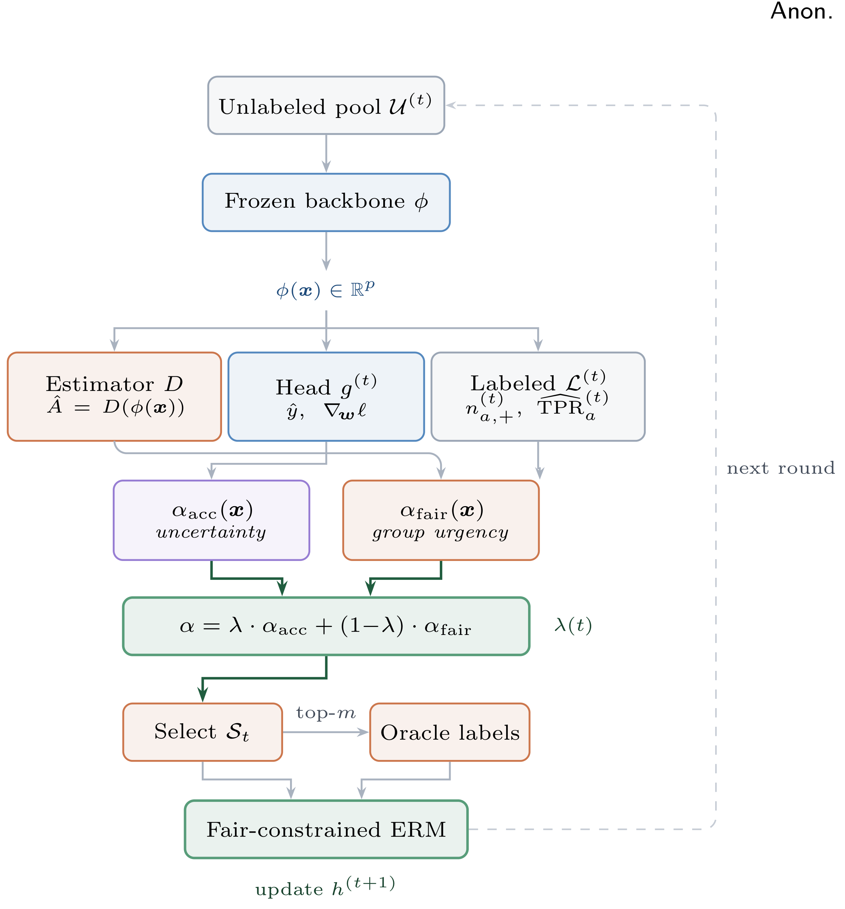

<div align="center">

# FairVAL

### Fair Visual Active Learning with Information-Theoretic Guarantees

[](https://www.python.org/downloads/)
[](https://pytorch.org/)
[](LICENSE)

</div>

---

**FairVAL** is the first active learning framework that provides *information-theoretic guarantees* for demographic fairness in visual recognition. It answers a fundamental question: **how many labeled images must an active learner acquire to guarantee both accuracy and fairness?**

<div align="center">

</div>

## Key Results

| Property | Result |
|:---------|:-------|
| **DP is free** | Demographic Parity adds zero labeling cost |
| **EO has a tax** | Equal Opportunity costs Ω(k / (γ² p₊)) extra labels |
| **Noisy groups** | Inferring demographics inflates cost by (1−η)⁻² |
| **Label savings** | Up to 35% fewer labels than fairness-agnostic baselines |
| **WGR improvement** | Closes worst-group recall gaps by up to 12.8 pp |

## Installation

```bash
git clone https://github.com/anonymous/fairval.git
cd fairval
pip install -e .
```

**Requirements:** Python ≥ 3.9, PyTorch ≥ 2.0, CUDA ≥ 11.8

## Quick Start

### 1. Run FairVAL on Fitzpatrick-17k

```bash
python scripts/train.py \
    --config configs/fitzpatrick.yaml \
    --backbone clip-vit-b16 \
    --budget 0.10 \
    --gamma 0.05 \
    --seed 42
```

### 2. Evaluate

```bash
python scripts/evaluate.py \
    --checkpoint outputs/fitzpatrick/best.pt \
    --dataset fitzpatrick
```

### 3. Run full ablation study

```bash
python scripts/ablation.py --config configs/fitzpatrick.yaml
```

## Project Structure

```
fairval/
├── fairval/                # Core library
│   ├── __init__.py
│   ├── algorithm.py        # Main FairVAL loop (Algorithm 1)
│   ├── acquisition.py      # α_acc, α_fair, composite scoring
│   ├── scheduler.py        # Adaptive λ(t) sigmoid schedule
│   ├── backbone.py         # Frozen backbone wrappers (CLIP, DINOv2, ResNet)
│   ├── estimator.py        # Demographic estimator D
│   ├── trainer.py          # Fairness-constrained ERM
│   ├── metrics.py          # EOD, WGR, F1, labels-to-target
│   └── datasets.py         # Dataset loaders and preprocessing
├── scripts/
│   ├── train.py            # Training entry point
│   ├── evaluate.py         # Evaluation entry point
│   └── ablation.py         # Ablation experiments
├── configs/
│   ├── default.yaml        # Default hyperparameters
│   ├── fitzpatrick.yaml    # Fitzpatrick-17k config
│   ├── isic.yaml           # ISIC 2019 config
│   ├── chexpert.yaml       # CheXpert config
│   ├── eurocity.yaml       # EuroCity Persons config
│   ├── celeba.yaml         # CelebA config
│   └── fairface.yaml       # FairFace config
├── data/                   # Dataset root (see below)
├── requirements.txt
├── setup.py
└── LICENSE
```

## Datasets

Download and place datasets under `data/`:

| Dataset | Groups | p₊ | Download |
|:--------|:------:|:---:|:---------|
| Fitzpatrick-17k | 6 (skin type) | 0.14 | [Link](https://github.com/mattgroh/fitzpatrick17k) |
| ISIC 2019 | 6 (skin type via ITA) | 0.18 | [Link](https://challenge.isic-archive.com/data/) |
| CheXpert | 4 (race) | 0.38 | [Link](https://stanfordmlgroup.github.io/competitions/chexpert/) |
| EuroCity Persons | 2 (age) | — | [Link](https://eurocity-dataset.tudelft.nl/) |
| CelebA | 2 (gender) | 0.50 | [Link](https://mmlab.ie.cuhk.edu.hk/projects/CelebA.html) |
| FairFace | 7 (race) | 0.42 | [Link](https://github.com/joojs/fairface) |

## Configuration

All hyperparameters are set via YAML configs. Key parameters:

```yaml
# Acquisition
budget_fraction: 0.10      # Total label budget (fraction of pool)
rounds: 10                 # Number of AL rounds
batch_size: 100            # Labels per round (m = B/T)

# Fairness
gamma: 0.05                # Fairness tolerance
beta: 10                   # Sigmoid temperature for λ(t)
c: 1.0                     # Uncertainty scaling in w_a

# Backbone
backbone: clip-vit-b16     # One of: clip-vit-b16, dinov2-vit-s14, resnet50
```

## Reproducing Paper Results

### Main comparison (Table 2)

```bash
for dataset in fitzpatrick isic fairface; do
    for method in random entropy badge coreset typiclust fare fairval; do
        python scripts/train.py \
            --config configs/${dataset}.yaml \
            --method ${method} \
            --seeds 1 2 3 4 5
    done
done
```

### Theoretical validation (Figures 3–4)

```bash
# Scaling with k (Figure 3a)
for k in 2 3 5 7; do
    python scripts/train.py \
        --config configs/fairface.yaml \
        --subsample_groups ${k} \
        --method fairval
done

# Scaling with 1/p+ (Figure 3b)
for pplus in 0.05 0.10 0.18 0.30; do
    python scripts/train.py \
        --config configs/isic.yaml \
        --subsample_prevalence ${pplus} \
        --method fairval
done
```

### Noise robustness (Figure 5)

```bash
for eta in 0.0 0.05 0.10 0.15 0.20 0.25 0.30; do
    python scripts/train.py \
        --config configs/fitzpatrick.yaml \
        --noise_rate ${eta} \
        --method fairval
done
```

## Algorithm Overview

FairVAL operates in rounds. At each round *t*:

1. **Embed** all unlabeled samples through frozen backbone φ
2. **Score** each sample with composite acquisition function:
   - α\_acc: gradient-norm uncertainty (BADGE-style)
   - α\_fair: group-urgency × positive probability
   - α = λ(t) · α\_acc + (1−λ(t)) · α\_fair
3. **Adapt** λ(t) via sigmoid schedule based on current fairness gap
4. **Select** top-*m* samples, query oracle, retrain under fairness constraints

## License

This project is licensed under the MIT License. See [LICENSE](LICENSE) for details.
